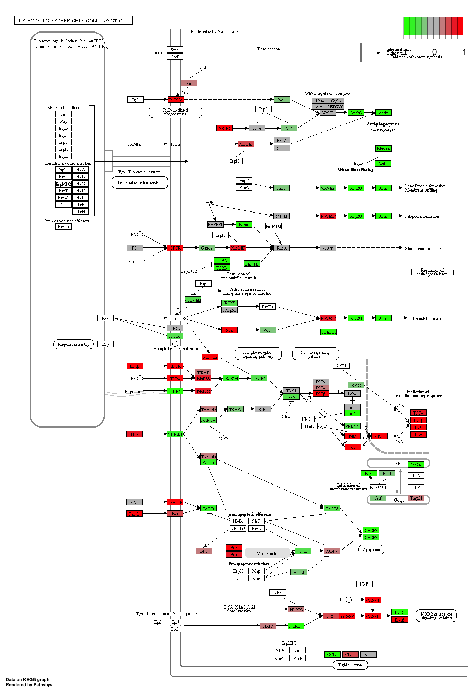

1. Input our counts and metadata files.
- check the format and fix if necessary
- QC: run a PCA

2. Run differential expression analysis
- setup that objext requried by deseq()
- run deseq

3. Add annotation
- gene names and entrez ids

4. Vocano plot

5. Pathway analysis

6. Save results

7. Go have fun!

```{r setup, message=FALSE}
library(DESeq2)
library(ggplot2)
library(AnnotationDbi)
library(org.Hs.eg.db)
library(pathview)
library(gage)
library(gageData)
library(dplyr)
```

# Input counts and metadata

```{r readcsv}
countData <- read.csv("GSE37704_featurecounts.csv",row.names = 1)
colData <- read.csv("GSE37704_metadata.csv")
```


```{r}
countData <- countData[,-1]
head(countData)
```


```{r}
all(colData$id == colnames(countData))
```
## Remove zero count genes

```{r}
counts <- countData[rowSums(countData) != 0,]
head(counts)
```

## Principal Component Analysis

We will often turn to PCA for quality control here at this early stage. The idea is that we should see differences between our control and condition of interest.

```{r}
pca <- prcomp(t(counts),scale = TRUE)
summary(pca)
```

```{r}
pca$x
```


```{r}

plot(pca$x[,1:2],col=as.factor(colData$condition),pch=16)
```


## DESeq Analysis

Like like lots of bioconductor functions it wants our data in a organized way.

```{r}
control.inds <- which(colData$condition == "control_sirna")
control.counts <- countData[,control.inds]
head(control.counts)
```


```{r}
dds <- DESeqDataSetFromMatrix(countData=counts, 
                              colData=colData, 
                              design=~condition)
dds
```
Run our DESeq analysis
```{r}
dds <- DESeq(dds)
res <- results(dds)
res
```

```{r}
library(dplyr)
dat <- as.data.frame(res)
dat <- na.omit(dat)
k1 = (dat$padj < 0.01)&(dat$log2FoldChange < -2)
k2 = (dat$padj < 0.01)&(dat$log2FoldChange > 2)
deg <- mutate(dat,change  =ifelse(k1,"down",ifelse(k2,"up","stable")))
table(deg$change)
```


## Vocano plot

```{r}
mycols <- rep("gray", nrow(res))
mycols[ abs(res$log2FoldChange) > 2 ]  <- "red" 

inds <- (res$padj < 0.01) & (abs(res$log2FoldChange) > 2 )
mycols[ inds ] <- "blue"

# Volcano plot with custom colors 
plot( res$log2FoldChange,  -log(res$padj), 
 col=mycols, ylab="-Log(P-value)", xlab="Log2(FoldChange)" )

# Cut-off lines
abline(v=c(-2,2), col="gray", lty=2)
abline(h=-log(0.1), col="gray", lty=2)
```

```{r}
library(dplyr)
library(ggplot2)

p <- ggplot(data = deg, 
            aes(x = deg$log2FoldChange, 
                y = -log(deg$padj))) +
  geom_point(alpha=0.4, size=3.5, 
             aes(color=change)) +
  xlab("log2(FoldChange)")+
  ylab("-log(P-value)")+
  scale_color_manual(values=c("blue", "grey","red"))+
  geom_vline(xintercept=c(-2,2),lty=4,col="black",lwd=0.8) +
  geom_hline(yintercept = -0.01,lty=4,col="black",lwd=0.8) +
  theme_bw()
p


```


## Add annotation


```{r}
res$symbol <- mapIds(org.Hs.eg.db,
                     keys=row.names(res), # Our genenames
                     keytype="ENSEMBL",        # The format of our genenames
                     column="SYMBOL",          # The new format we want to add
                     multiVals="first")

res$entrez <- mapIds(org.Hs.eg.db,
                     keys=row.names(res), # Our genenames
                     keytype="ENSEMBL",        # The format of our genenames
                     column="ENTREZID",       # The new format we want to add
                     multiVals="first")
head(res)
```


```{r}
library(EnhancedVolcano)
x <- as.data.frame(res)
EnhancedVolcano(x,
                lab = x$symbol,
                x = "log2FoldChange",
                y = "pvalue")

#ggplot(x) +
#  aes(log2FoldChange, -log(padi)) +
#  geom_point()
```

```{r}
summary(-log(x$padj))

hist(-log(x$padj))

```


## Pathway analysis

We will use `gage()` with KEGG and GO genesets here. 

```{r}


foldchanges = res$log2FoldChange
names(foldchanges) = res$entrez
head(foldchanges)
```

```{r}
data(kegg.sets.hs)
data(sigmet.idx.hs)

kegg.sets.hs = kegg.sets.hs[sigmet.idx.hs]
```


```{r}
keggres = gage(foldchanges, gsets=kegg.sets.hs)
attributes(keggres)
head(keggres$less,4)
```

Let's pull up one of these kegg pathways with our DEGs shown.

```{r}
pathview(gene.data=foldchanges, pathway.id="hsa05130")
```

```{r}
pathview(gene.data=foldchanges, pathway.id="hsa04110")
```


Gene Ontology, Reactome, and many others...

To use GO (Gene Ontology) we just pass in the GO genesets to in place of KEGG (that we used above)

```{r}
data("go.sets.hs")
data("go.subs.hs")

gobpsets=go.sets.hs[go.subs.hs$BP]

gobpres=gage(foldchanges,gsets=gobpsets,same.dir = TRUE)
lapply(gobpres, head)
head(gobpres$less, 4)
```


# Save results

```{r}
write.csv(res,file="deseq_results.csv")
```


